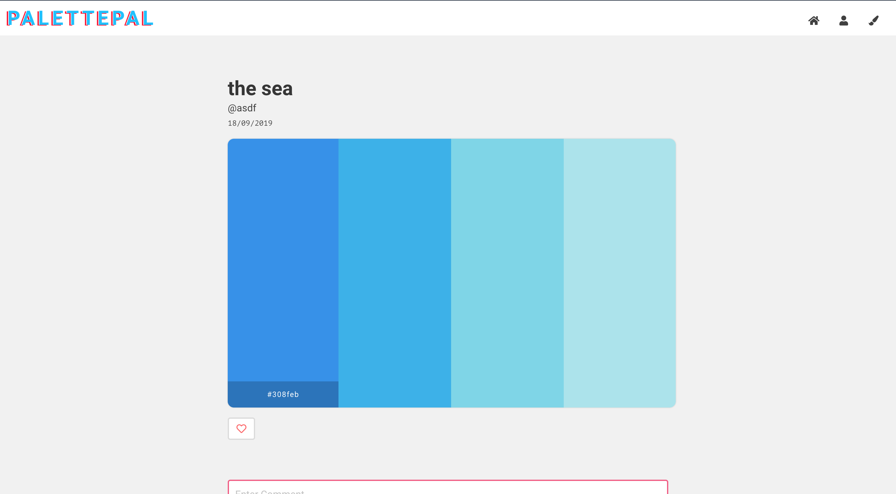

# Palette Pals

Pallete pals is a social media website where users can create, share, like, and comment on color palettes.

## GET STARTED IN 3 Steps

### STEP 1 -- Sign up

As a first time user you can sign up by clicking the person icon at the top right screen. 

You will be prompted to the following page where you can sign in / sign up:

## STEP 2 -- Create a palette

Creating a palette is easy. Just click the brush on the top right, and you will be taken to the following page where you can start creating.

### Clicking any colour-box will bring up a tool which you can use to input a color of your choice:

Once you've inputed your colours, the boxes' colours will change: 

On clicking the 'Create Palette' button you will be redirected to the following page which showcases your palette:

#### P.S: Creating a palette automatically shares it on the home page.

### STEP 3 -- Viewing your palettes

If you want to see all of your palettes, you can click the person icon at the top right. 
This will redirect you to the following page:

